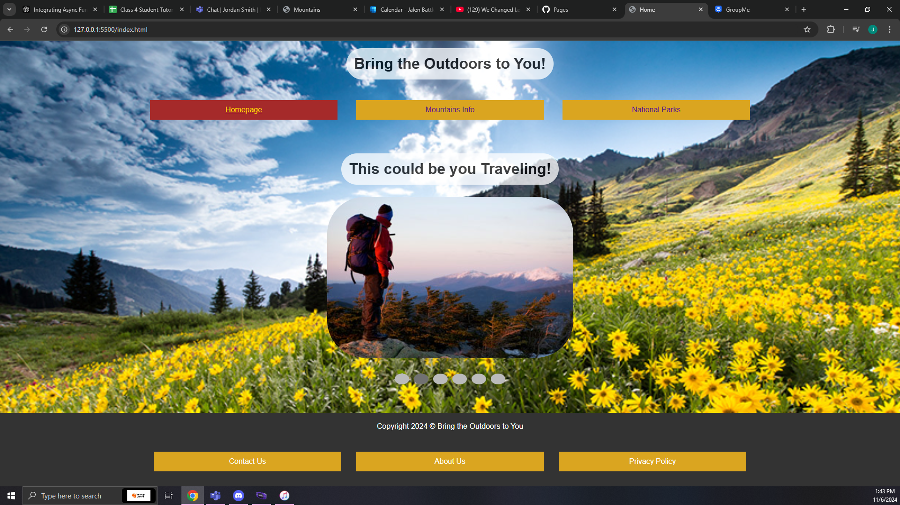
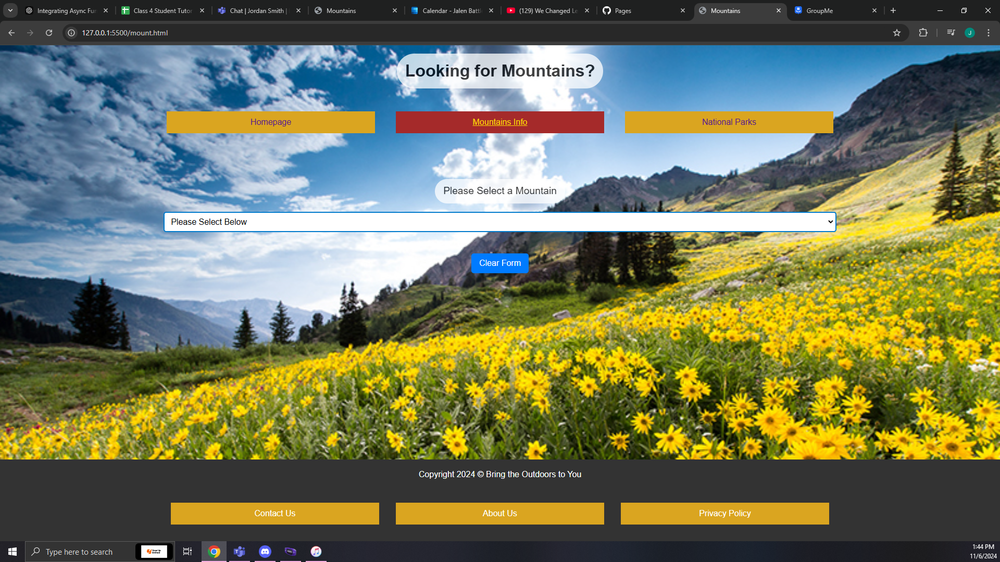
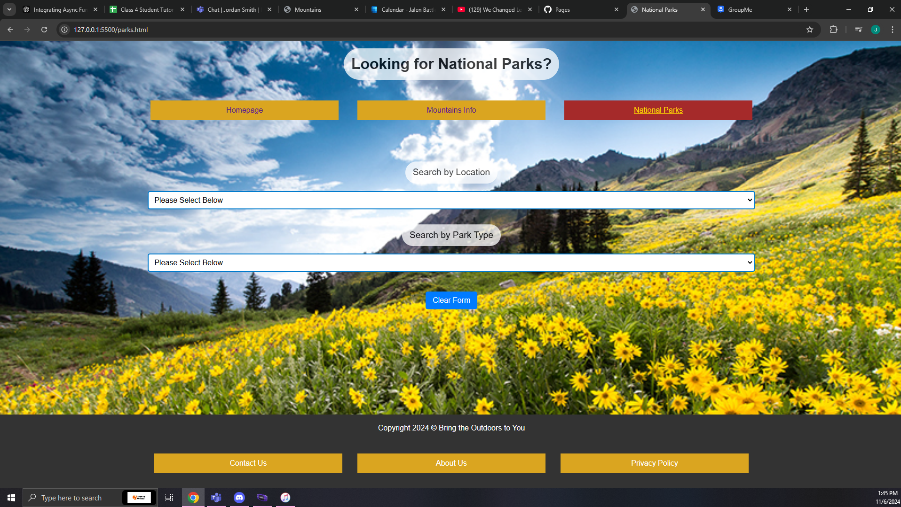
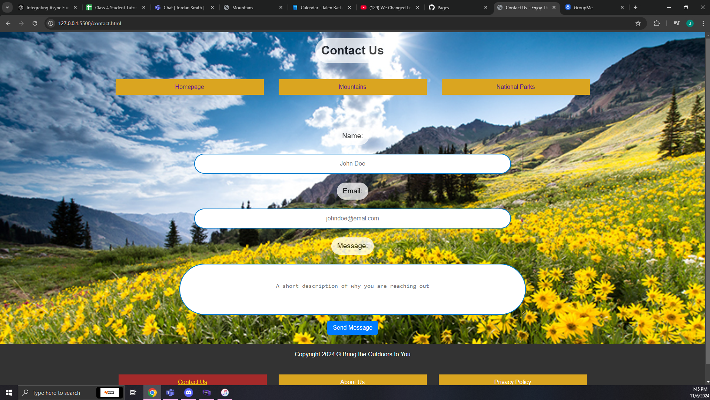
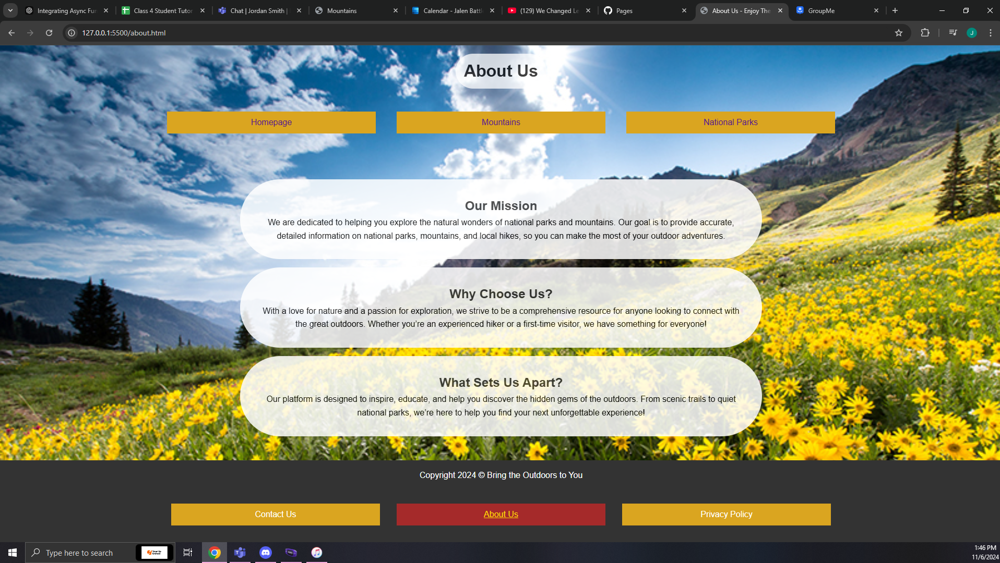
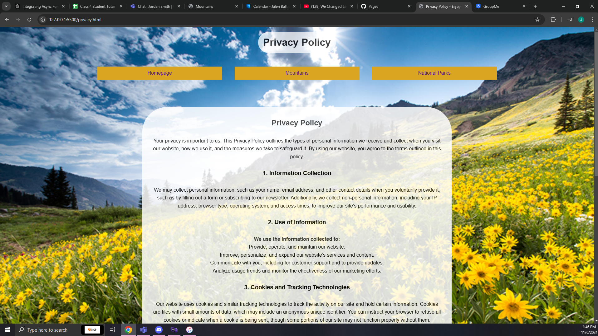

# Enjoy the Outdoors

Welcome to **Enjoy the Outdoors**! This project provides an interactive and informative experience for outdoor enthusiasts looking to explore national parks and mountains across the United States.

## Table of Contents
- [Overview](#overview)
- [Features](#features)
- [Technologies](#technologies)
- [Setup](#setup)
- [Screenshots](#screenshots)
- [Usage](#usage)
- [Live Demo](#live-demo)
- [Contributing](#contributing)
- [License](#license)

## Overview
**Enjoy the Outdoors** is a website dedicated to helping users discover and learn about various outdoor locations. Whether you're interested in finding mountains to hike, national parks to visit, or other natural landmarks, this site is designed to bring the outdoors to you. 

## Features
- **Search National Parks**: Filter parks by location and park type, and view relevant details such as address, phone, and website.
- **Mountain Information**: Select a mountain to view its elevation, location, and sunrise/sunset times.
- **Slideshow of Scenery**: A rotating image gallery on the homepage provides a glimpse of scenic locations.
- **Additional Pages**: Learn more about the mission of the site and our commitment to privacy, or contact us directly.

## Technologies
- **HTML, CSS, JavaScript** for building and styling the website.
- **Bootstrap** for responsive design elements.
- **GitHub Pages** for hosting.

## Setup
1. **Clone the repository**:
    ```bash
    git clone https://github.com/jbatts/EnjoyTheOutdoors.git
    ```
2. **Navigate to the project folder**:
    ```bash
    cd EnjoyTheOutdoors
    ```
3. **Open `index.html` in a web browser** to view the site locally.

## Usage
- To explore national parks and mountains, use the dropdowns to search and view information.
- Click on **slideshow dots** to navigate through the homepage image gallery.
- Visit the About Us, Contact Us, and Privacy Policy pages for additional details.

## Screenshots
- 
- 
- 
- 
- 
- 
## Live Demo
You can visit the live website at: [Enjoy the Outdoors](https://jbatts.github.io/EnjoyTheOutdoors/)

## Contributing
Contributions are welcome! Please fork the repository and make a pull request for any suggested improvements or features.

## License
This project is open-source and available under the MIT License.

---

Enjoy your journey through nature with **Enjoy the Outdoors**!
